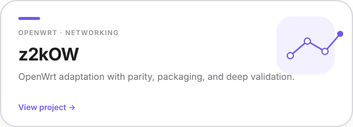
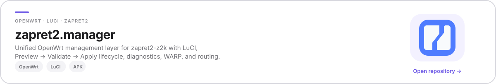
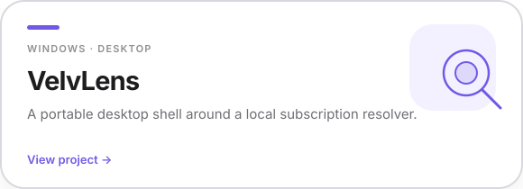
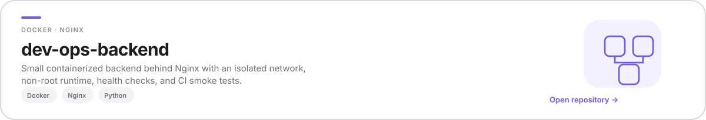

<picture>
  <source media="(prefers-color-scheme: dark)" srcset="./assets/hero-dark.svg">
  <source media="(prefers-color-scheme: light)" srcset="./assets/hero-light.svg">
  
</picture>

## About

I'm Kirill — a **DevOps / systems engineer** focused on Linux infrastructure, networking, OpenWrt, containers, and CI/CD.

Most of my projects start with a practical systems problem: make a service easier to deploy, make network behavior observable, remove manual operations, or turn a fragile setup into something reproducible.

**Core stack:** Linux · OpenWrt · Docker · Nginx · GitHub Actions · Bash · Python · Rust

## Selected projects

<a href="https://github.com/t0fox/z2kOW">
  <picture>
    <source media="(prefers-color-scheme: dark)" srcset="./assets/z2kow-dark.svg">
    <source media="(prefers-color-scheme: light)" srcset="./assets/z2kow-light.svg">
    
  </picture>
</a>

 
<a href="https://github.com/t0fox/zapret2-manager">
  <picture>
    <source media="(prefers-color-scheme: dark)" srcset="./assets/manager-dark.svg">
    <source media="(prefers-color-scheme: light)" srcset="./assets/manager-light.svg">
    
  </picture>
</a>

 

<a href="https://github.com/t0fox/VelvLens">
  <picture>
    <source media="(prefers-color-scheme: dark)" srcset="./assets/velvlens-dark.svg">
    <source media="(prefers-color-scheme: light)" srcset="./assets/velvlens-light.svg">
    
  </picture>
</a>

 

<a href="https://github.com/t0fox/dev-ops-backend">
  <picture>
    <source media="(prefers-color-scheme: dark)" srcset="./assets/backend-dark.svg">
    <source media="(prefers-color-scheme: light)" srcset="./assets/backend-light.svg">
    
  </picture>
</a>

## Currently

Working on OpenWrt networking and packaging, safer upstream synchronization for **z2kOW**, and small systems tools where diagnostics and reproducible builds matter as much as the feature itself.

Also experimenting with Rust-based systems tooling.

## Activity

<picture>
  <source media="(prefers-color-scheme: dark)" srcset="https://raw.githubusercontent.com/t0fox/t0fox/output/github-contribution-grid-snake-dark.svg">
  <source media="(prefers-color-scheme: light)" srcset="https://raw.githubusercontent.com/t0fox/t0fox/output/github-contribution-grid-snake.svg">
  
</picture>

 

<code>build · observe · verify · ship</code>

