<div align="center">



<br />

[](https://github.com/t0fox)
[](https://github.com/t0fox)
[](https://github.com/t0fox/z2kOW)
[](https://github.com/t0fox/dev-ops-backend)

</div>

## `> whoami`

I build and break things around **Linux, networking, containers and infrastructure**.

My current focus is practical systems work: routing, OpenWrt, Dockerized services, automation, diagnostics and reproducible CI.

<div align="center">
  
</div>

<br />

## `> featured_systems`

<table>
<tr>
<td width="50%" valign="top">

### [z2kOW](https://github.com/t0fox/z2kOW)
**NETWORKING · OPENWRT · TRAFFIC**

OpenWrt adaptation and parity work around the z2k / zapret2 networking stack, with an emphasis on runtime behavior, diagnostics and reproducible validation.

`OpenWrt` `Shell` `Networking` `CI`

</td>
<td width="50%" valign="top">

### [VelvLens](https://github.com/t0fox/VelvLens)
**DESKTOP · SUBSCRIPTIONS · PACKAGING**

Standalone Windows Electron application embedding a pinned Sub-Store frontend/backend with a local resolver, portable packaging and verification gates.

`Electron` `Node.js` `Windows` `Packaging`

</td>
</tr>
<tr>
<td width="50%" valign="top">

### [dev-ops-backend](https://github.com/t0fox/dev-ops-backend)
**DOCKER · NGINX · CI**

Containerized backend behind Nginx with an isolated bridge network, non-root runtime, health checks and smoke-tested GitHub Actions CI.

`Docker Compose` `Nginx` `Python` `GitHub Actions`

</td>
<td width="50%" valign="top">

### [zapret2-manager](https://github.com/t0fox/zapret2-manager)
**WEB UI · OPERATIONS · AUTOMATION**

Management tooling around zapret2 with a focus on operational visibility, strategy workflows and a cleaner day-to-day control surface.

`Web UI` `Automation` `Diagnostics` `Networking`

</td>
</tr>
</table>

## `> current_focus`

```text
[01] Linux & service operations
[02] OpenWrt / routing / traffic processing
[03] Docker & container networking
[04] CI/CD and reproducible validation
[05] Rust and systems tooling
```

## `> contribution_stream`

<div align="center">

<picture>
  <source media="(prefers-color-scheme: dark)" srcset="https://raw.githubusercontent.com/t0fox/t0fox/output/github-contribution-grid-snake-dark.svg" />
  <source media="(prefers-color-scheme: light)" srcset="https://raw.githubusercontent.com/t0fox/t0fox/output/github-contribution-grid-snake.svg" />
  
</picture>


<sub><code>t0fox@github:~$ _</code></sub>

</div>
